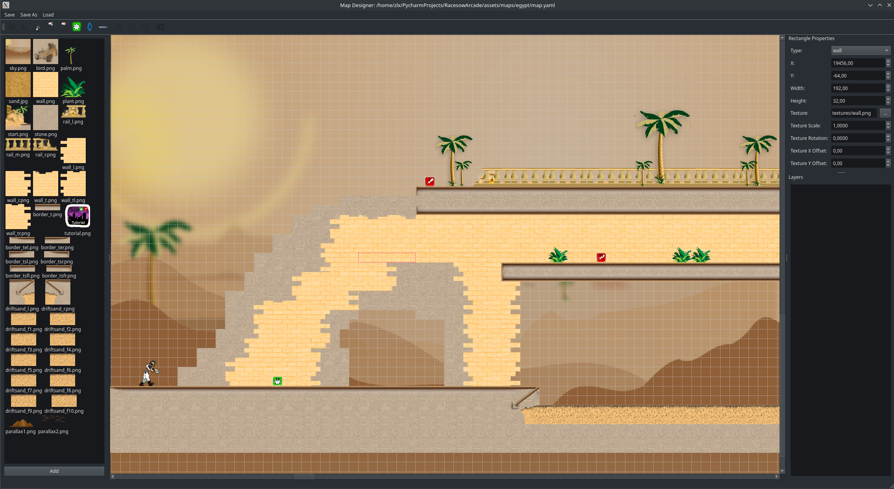

# Racesow Arcade Map Editor

build your own maps for https://github.com/zolex/racesow-arcade

easiest is to run the [latest precompiled binary from the releases page](https://github.com/zolex/RAME/releases/tag/alpha.1). alternatively you can install python to run the code directly.

